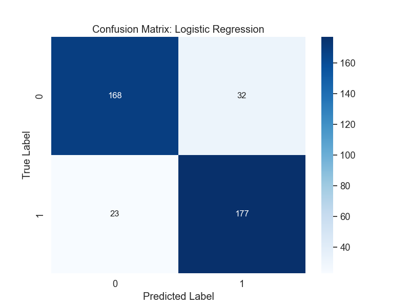
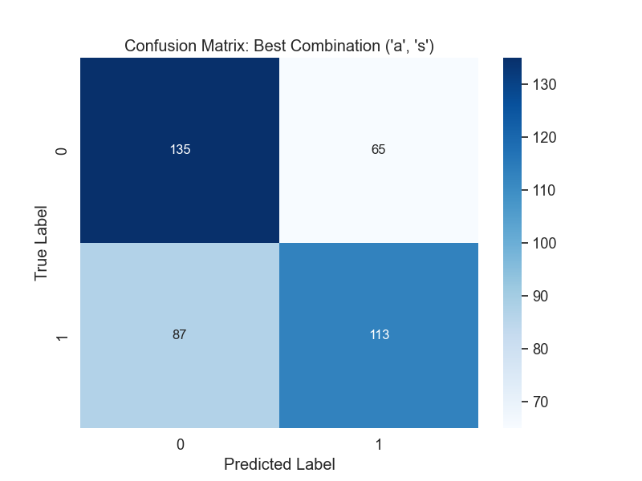

# Opinion Detector

## Project Overview
This Opinion Detector leverages supervised and unsupervised machine learning methods to classify movie reviews as positive or negative. Built with scikit-learn and NLTK, this tool demonstrates robust text analysis capabilities, making it ideal for understanding public sentiments in movie reviews.

## Key Features
- **Supervised Learning Models**: Implements several algorithms like Logistic Regression, Random Forest, SVM, and Naive Bayes for precise sentiment classification.
- **Unsupervised Approach**: Uses Lesk algorithm and SentiWordNet for sentiment analysis without labeled data, ideal for exploratory data analysis.
- **Performance Metrics**: Achieves strong classification metrics, with Logistic Regression showing an F1-score over 0.86.
- **Error Analysis**: Provides insights into model predictions with detailed error analysis, improving model reliability.

## Results
The supervised models, particularly Logistic Regression, achieved impressive F1-scores and accuracy, demonstrating their effectiveness in classifying sentiments accurately. The unsupervised model offers a valuable alternative for scenarios lacking labeled data, though with lower accuracy and f1-score (around 0.65).

### Confusion Matrix Examples
Here are visual representations of model performances, highlighting the strengths and areas for improvement:
- **Supervised Model (Logistic Regression)**
  - 
- **Unsupervised Model**
  - 

## Conclusion
The Opinion Detector excels in processing and classifying sentiments in movie reviews, with its advanced use of machine learning techniques. While the supervised approach shows superior performance, the unsupervised method remains valuable for specific use cases, demonstrating the flexibility and scalability of the application although the limitation created by the negation words that invert the sentiment of a part of the review and are very difficult to detect using not-advanced algorithms.

## How to Use
1. **Prepare your data**: Ensure your reviews are in a text format.
2. **Choose the model**: Decide between supervised or unsupervised based on your data.
3. **Run the model**: Use the provided scripts to classify your reviews.
4. **Analyze the results**: Evaluate the performance using the metrics and confusion matrices provided.
